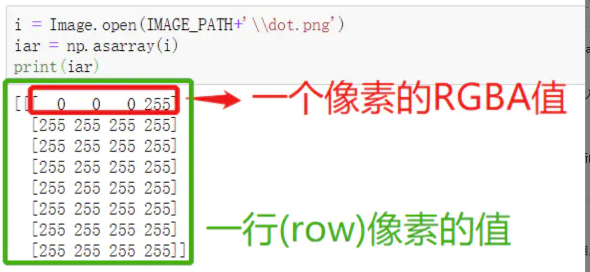
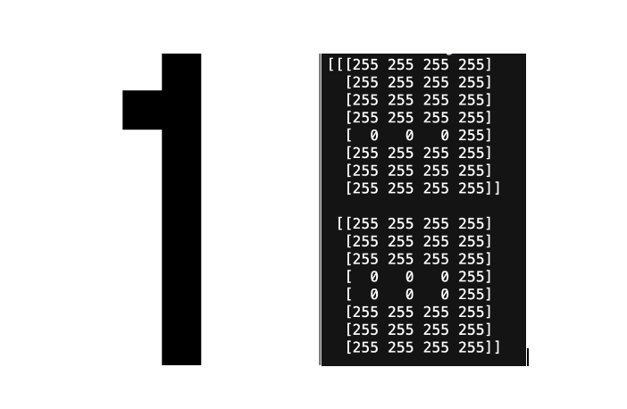
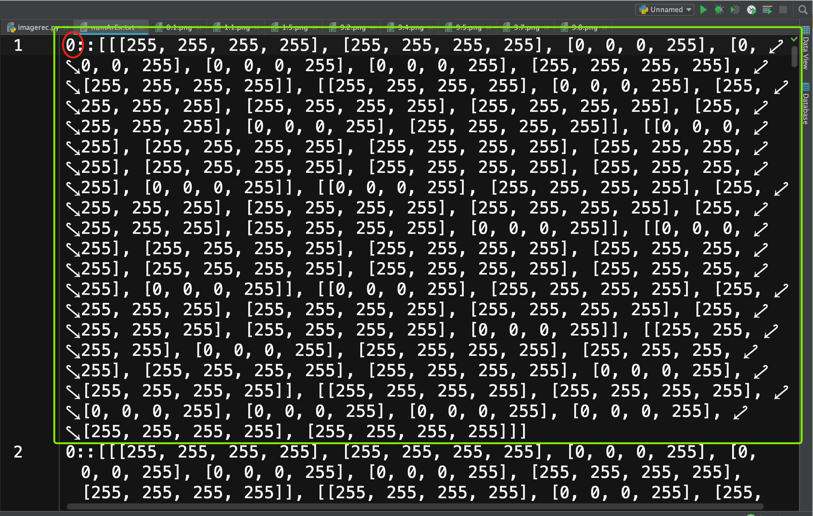

图像识别实验（下）
**********

这次实验课的任务是识别手写的数字。

1.图像识别原理
------------

通过前面几节课的学习，我们知道一幅图像是由像素点矩阵组成的。每一个像素点由红、绿、蓝以及Alpha通道组成。Alpha通道表示像素的透明度，255表示完全不透明，0表示完全透明。

例如，PNG图像是一种典型的4通道图像。

这是一个表示图像的三位数组，按照行（row），列（column），像素通道来排列。绿色部分表示第一行的8个像素值，红色部分表示第一行第一列的像素值。

下图是数字1的图像，以及它图像矩阵的前两行。可以看出来数字1是从第一行的第几个像素点开始写的么？如果你能回答出来，那么说明你已经理解了图像编码的方式。

如果你现在在8x8的图像上，手写一个数码1，怎么让计算机可以识别出这个数码呢？简单来说，我们需要训练计算机，让它可以找到数码1这幅图像的模式（Pattern)，再将这种模式应用到新的图像上。找到图像模式的方式有很多，甚至是学术界和工业界的研究热点，我们这堂课上，我们通过对像素点的值进行匹配。

2. 处理训练图像
------------

我们为0-9十个数字分别准备了10张手写图像，这些图像构成了程序的学习资料。我们第一步是将每一副图像都转化为像素矩阵（数据），并且给矩阵贴上一个标签（tag）。标签表示该矩阵对应的数字。

.. code-block:: text

    def createExamples():
        numberArrayExample = open('numArEx.txt', 'a') #append
        numbersWeHave = range(0,10)
        versionsWeHave = range(1,10)

        for eachNum in numbersWeHave:
            for eachVer in versionsWeHave:
                #print(str(eachNum) + '.' + str(eachVer))
                imgFilePath = 'images/numbers/' + str(eachNum) + '.' + str(eachVer) + '.png'
                print(imgFilePath)

                ei = Image.open(imgFilePath)  #通过路径加载对应图像
                eiar = np.array(ei)  #将图像转化为像素矩阵
                eiar1 = str(eiar.tolist())  #将像素矩阵转换为字符串，这便于我们后续对图像进行比较

                lineToWrite = str(eachNum)+'::'+eiar1+'\n'  #将图像矩阵转变为一行，格式是标签::图像像素数据

                numberArrayExample.write(lineToWrite)  #将这一行写到numArEx.txt这个文件中

你可以打开numArEx.txt这个文件，应该共有90行，每一行代表一张图片的像素信息。

绿色部分表示第一张图片的信息，红色部分是训练数据的标签，也就是对应的数码。

