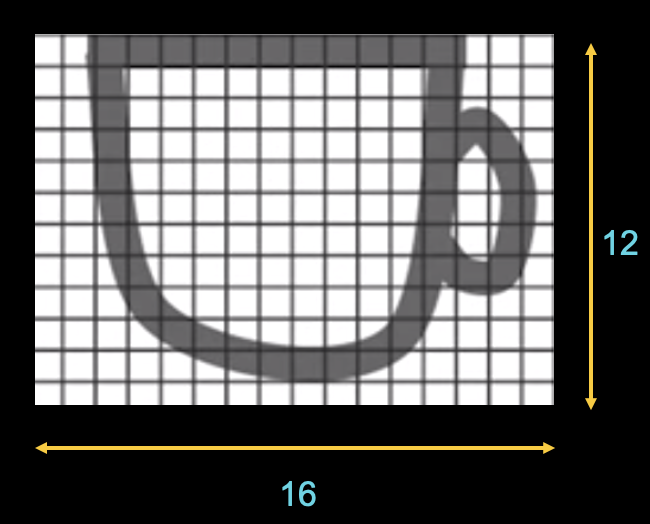
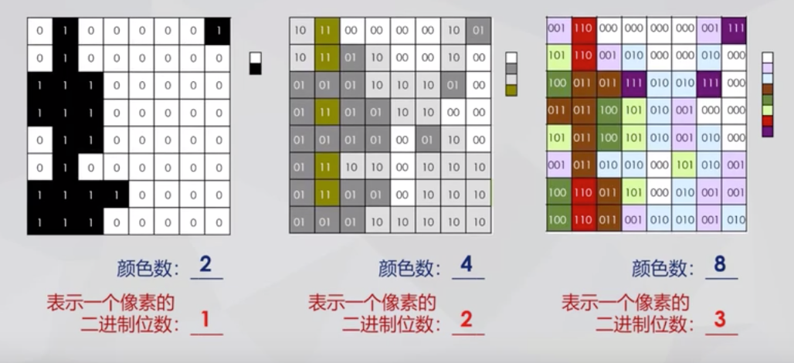

PyCharm入门
******

实验
=======

上学期我们主要通过网站来编写和运行Python程序。

通过网站编程的好处是无需安装额外软件，可以随时随地进行程序编写。

但也有不好的地方。由于网站提供的函数和工具有限，我们只能进行简单的操作。所以网站编程只适合初学者入门学习。

如果我们要编写更复杂的程序，例如读取和处理图像，我们就需要更为专业的编程工具。

目前世界最流行的Python编程工具是PyCharm，它是由JetBrains打造的编译工具。作为高中生，我们可以免费使用这款工具。

下面是基于Mac的PyCharm安装步骤。基于Windows的安装步骤非常类似，有一些不同的地方我会指出。

1. 下载PyCharm
----
PyCharm是由JetBrains打造的编译工具。

下载地址：`PyCharm <https://www.jetbrains.com/pycharm/download>`_

选择Community版本并下载。

2. 安装PyCharm
-------------
双击下载后的文件，将PyCharm拖到Applications中。

.. image:: drag.png
   :scale: 50%

选择Do not import settings

.. image:: import.png
   :scale: 50%

3. 安装Python
------------
到了这一步我们已经成功一半了！我们已经安装好Python的编程工具，接下来我们需要将Python安装到计算机里。

分辨率
-----
图像中像素的数量。

上图茶杯的图像横向方向有16个像素，纵向方向有12个像素。该图像的分辨率：16x12=192

像素编码
-------
像素编码是指用二进制来表示像素的颜色。

* 位深度：像素编码的二进制位数。位深度决定了图像所包含的最大颜色数。

.. note::

    像素为深度为N，则像素颜色最多可以有2^N种不同的可能性。

矢量图
=====

矢量图使用直线和曲线等属性来描述图形，是通过数学公式获得的。矢量图经常用来做为商标Logo图像使用。

.. note::

    位图优点是色彩丰富，缺点是位图放大之后会模糊失真。矢量图优点是无论放大、缩小或者旋转等都不会失真，缺点是难以表现色彩层次丰富的逼真图像效果。

.. code-block:: text

   问题1: 16色位图，每个像素需要几位二进制来表示？

   答案：4

.. code-block:: text

   问题2: 一个分辨率为16*16的16位位图需要占用多少字节？

   解答：分辨率16*16表示有256个像素点，每个像素点用16位编码，所以总共需要用256*16（位）进行编码。

   所需字节：256*16/8 = 512字节

.. code-block:: text

   问题3: 一个分辨率为16*16的16色位图需要占用多少字节？

   解答：分辨率16*16表示有256个像素点，16色位图说明每个像素点用4位编码，所以总共需要用256*4（位）进行编码。

   所需字节：256*4/8 = 128字节

