PyCharm入门
******

实验
=======

上学期我们主要通过网站来编写和运行Python程序。通过网站编程的好处是无需安装额外软件，可以随时随地进行程序编写。但也有不好的地方。由于网站提供的函数和工具有限，我们只能进行简单的操作。所以网站编程只适合初学者入门学习。

如果我们要编写更复杂的程序，例如读取和处理图像，我们就需要更为专业的编程工具。目前世界最流行的Python编程工具是PyCharm，它是由JetBrains打造的编译工具。作为高中生，我们可以免费使用这款工具。下面是基于Mac的PyCharm安装步骤。基于Windows的安装步骤非常类似，所以以下操作步骤也适用于你。除此之外你也可以参考这个教程：`Windows版PyCharm安装 <http://c.biancheng.net/view/5804.html>`_ 。当然，你也可以咨询已经安装成功的小伙伴，比如Windows的安装过程你可以咨询张天宇和侯辰菱同学。

1. 下载PyCharm
----
PyCharm是由JetBrains打造的编译工具。

下载地址：`PyCharm <https://www.jetbrains.com/pycharm/download>`_

选择Community版本并下载。

2. 安装PyCharm
-------------
双击下载后的文件，将PyCharm拖到Applications中。

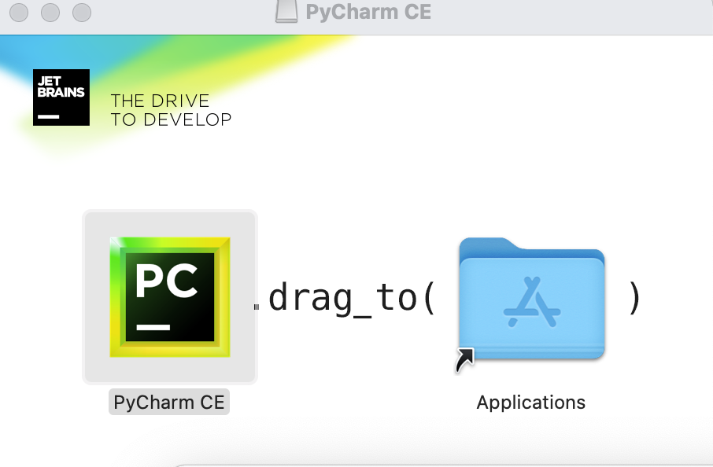

选择Do not import settings

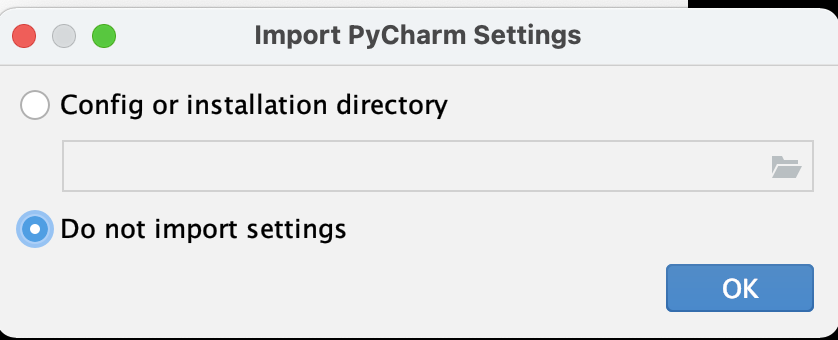

3. 下载并安装Python
------------
到了这一步我们已经成功一半了！Python是一门编程语言，下一步我们需要安装它的**Interperter(解释器）**（巧了，Python的解释器也叫Python)。

下载地址：`Python Download <https://www.python.org/downloads/>`_

点击有Download的黄色按钮下载最新版本的Python。

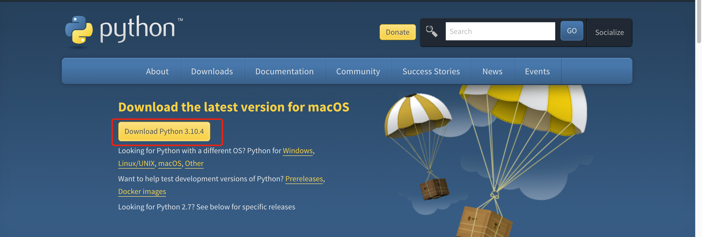

下载完毕之后安装Python。在点击若干continue和agree之后，Python解释器就成功安装在我们的电脑里了。从现在开始，我们的计算机也可以读懂Python程序了（哦还差一点）。

4. 在PyCharm中配置Python
-----------------------
打开PyCharm，点击New Project。

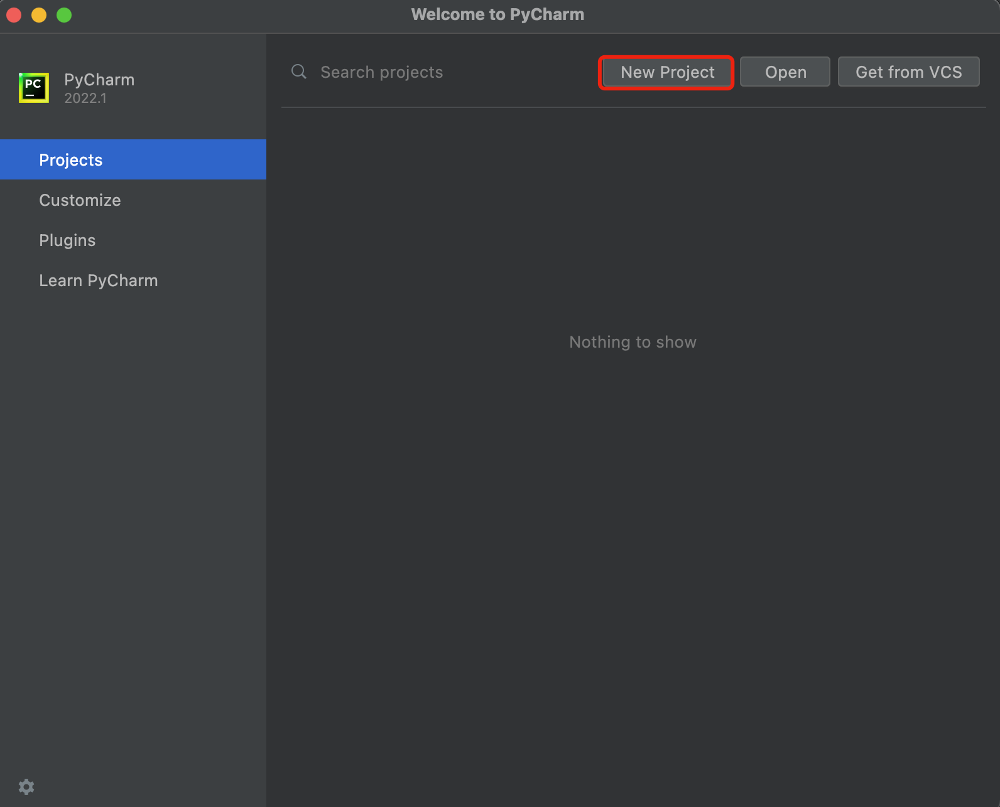

接下来关注两个红框的地方：

1. Location这一栏是给你的项目进行命名的位置，你可以将最后的文件名改为你想要的任意文件名，例如hw1。

2. 选择Previously configured interpreter, 在下拉栏中选择Python 3.10（希望它已经出现在那里了）。

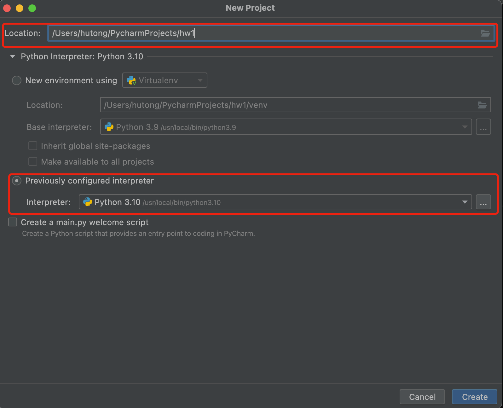

点击Create，到这里我们成功了90%了。

5. 新建文件
----------

右键hw1 -> New -> Python File，取一个名字（比如loop)，按下回车。你会发现hw1项目下出现了一个文件：loop.py。

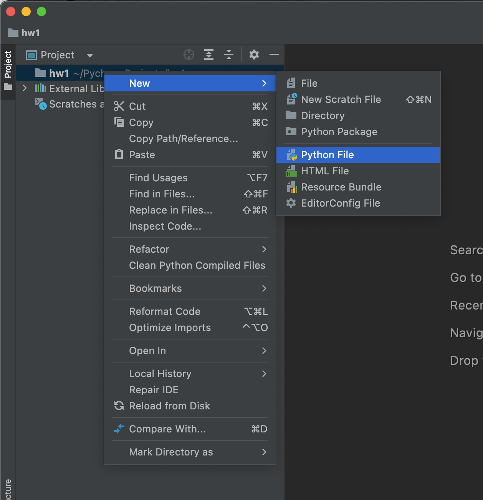

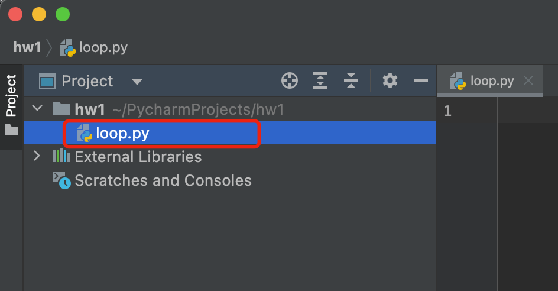

右上角Add configuration -> 点击左上角'+' -> 选择Python

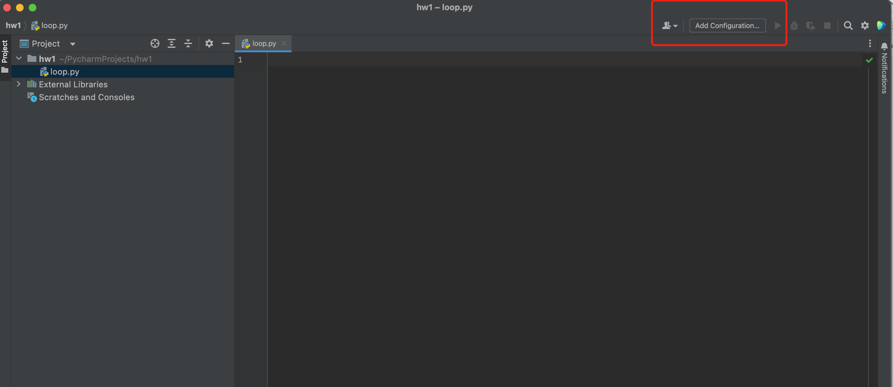

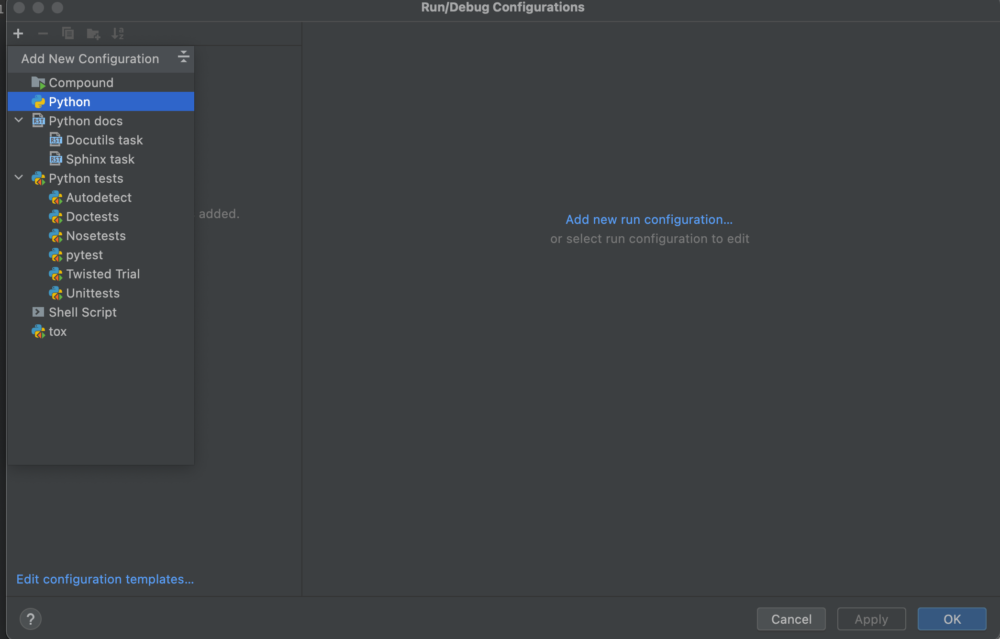

接下来Script path这个地方，选择我们刚刚创建的文件（比如我是loop.py)

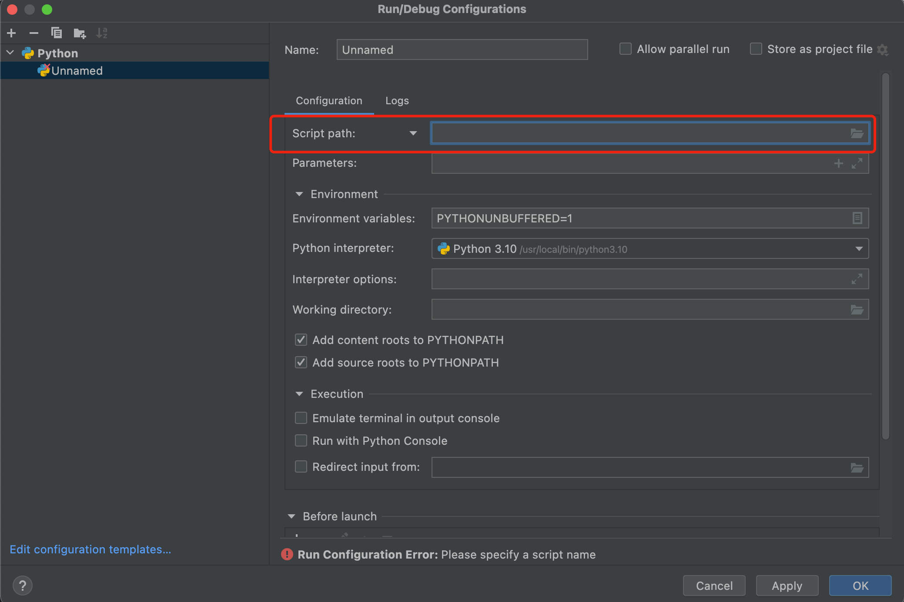

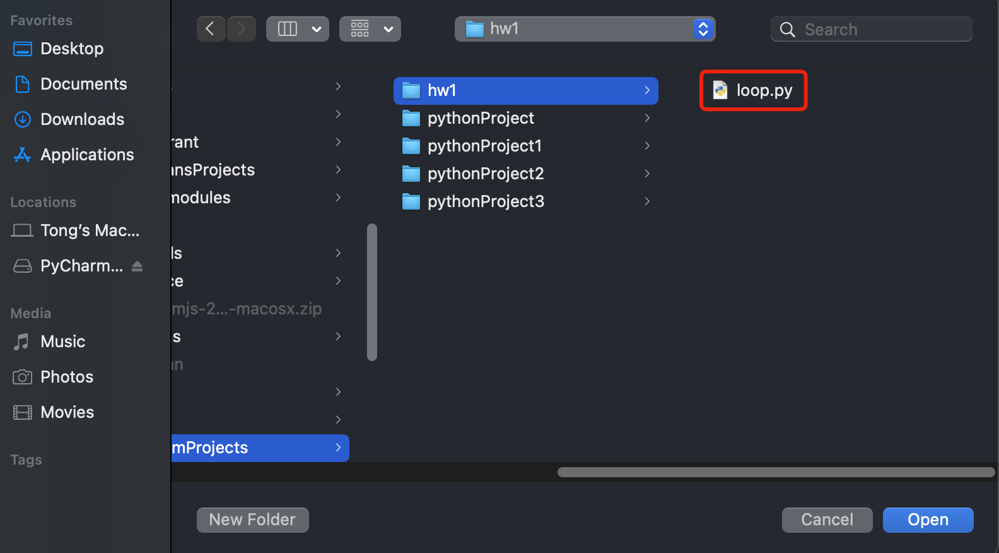

到这里，我们就完成了所有的配置，是不是觉得也不是那么难呢？那还剩最后一步，就是程序的编写与运行。

6. 编写并运行程序
----------

在窗口中输入一行程序：

.. code-block:: text

    print("hello")

输入完毕之后，点击右上角的三角形（运行按钮）。如果你可以在下方看到一行"hello"的输出，说明你刚刚在自己电脑上运行了一个Python程序！Hooray!!

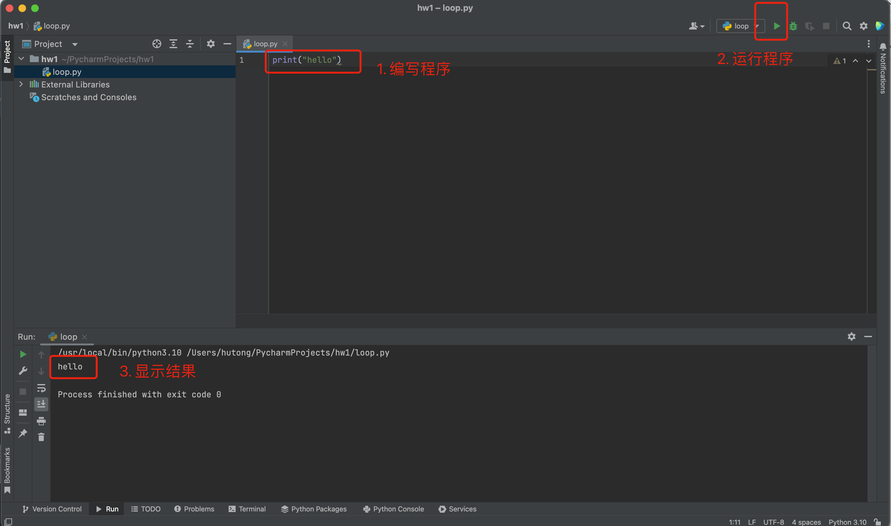

Q&A
----------
.. note::

    Q1: 安装PyCharm需要花多长时间？

    Answer: 配置编程环境有时候比编程还要费劲，但一旦配置成功，之后编程就会轻松很多。现在编程工具越来越人性化，几年前下载和安装工具可能需要花费一个学生3-4个小时的时间（嗯是的，我就是这个学生），但现在时间大为减少。考虑到大家是第一次安装，我预测应该会在1-2个小时之间。如果你发现超过3小时还未安装成功，请直接来联系我。

    跟编程一样，大家需要保持耐心。

    Q2: 我使用的是Windows系统，我可以使用PyCharm吗？

    Answer: 当然可以。PyCharm是支持所有操作系统的，而且这份安装教程也基本适用与你。当然你也可以参考网上的其它安装教程。

    在学习计算机的时候，要记住：Google is your best friend. 当你遇到什么困难的时候，你永远可以向它寻求帮助。

    Q3: 我进行到第5步了，但是并没有在下拉栏中找到Python 3.10，我是不是全部做错了？

    Answer: 恭喜你已经进行到第5步！和所有软件一样，Python会被安装在计算机的某个地方，我们叫做路径。如果你在PyCharm中没有找到它，你需要指明Python的路径。

    Python的通常会在"usr/local/bin"或者"usr/bin"两个路径下。点击右边的三个点，然后找到/usr/local/bin，点击Python 3.10，再确定就可以了！

