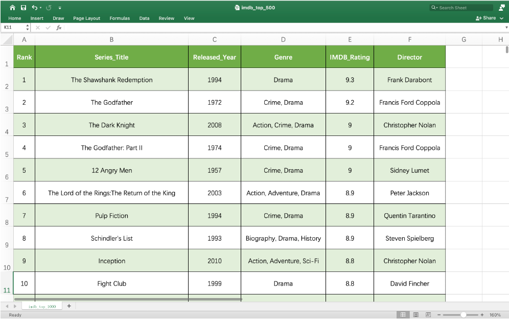

SQL
******

数据处理
=======

* 数据处理包括数据记录、计算、分析等方面。

* Excel是我们目前最熟悉的数据处理软件。上节课我们用Excel展示了IMDB的评分前500名的电影。

* Excel的好处在于：

  * 数据查找

  * 数据排序

  * 将数据以行和列的方式存储，每一行表示一条新的电影记录，而每一列代表电影的某种属性，如风格，或者导演。

* Excel的不足在于：

  * 不能存储大量数据。

  * 数据查询效率不高。

* CSV文件（Comma-Separated Values File)是一种以纯文本形式存储表格数据的文件格式。

* 我们不仅可以用Excel打开CSV文件，也可以用Python打开CSV文件。请下载 :download:`imdb_top_500.csv <imdb_top_500.csv>`。在PyCharm中输入以下指令：

.. code-block:: text

  import csv

  with open("imdb_top_500.csv", "r") as file:
      reader = csv.reader(file)
      next(reader)
      for row in reader:
          print("Movie " + row[1] + " is directed by " + row[5])

运行以后你会看到如下结果：

.. code-block:: text

  Movie The Shawshank Redemption is directed by Frank Darabont
  Movie The Godfather is directed by Francis Ford Coppola
  Movie The Dark Knight is directed by Christopher Nolan
  Movie The Godfather: Part II is directed by Francis Ford Coppola
  Movie 12 Angry Men is directed by Sidney Lumet
  Movie The Lord of the Rings:The Return of the King is directed by Peter Jackson
  Movie Pulp Fiction is directed by Quentin Tarantino
  Movie Schindler's List is directed by Steven Spielberg
  Movie Inception is directed by Christopher Nolan
  Movie Fight Club is directed by David Fincher
  ......

数据库（Database)
=======

* 数据库是结构化信息或数据（一般以电子形式存储在计算机系统中）的有组织的集合。

* 数据库一般由数据库管理系统（DBMS）来控制。

* 绝大部分的数据库都使用SQL语言（Structured Query Language)。

SQL
====

* 数据库的主要操作简称C.R.U.D

:guilabel:`CREATE`: 创建数据

:guilabel:`RETRIEVE`: 查询数据

:guilabel:`UPDATE`: 更新数据

:guilabel:`DELETE`: 删除数据

* SQL语法

:guilabel:`CREATE`

如果我们想要创建一个数据表，我们可以用

.. code-block:: text

  CREATE TABLE table_name(
    column1   type,
    column2   type,
    ……
    columnN   type);

:guilabel:`INSERT`

如果我们想要添加一行新的数据，我们可以用

.. code-block:: text

  INSERT INTO table_name VALUES(value1, value2, … , valueN);

:guilabel:`SELECT`

如果我们想要读取数据，我们可以用

.. code-block:: text

  SELECT column1, column2, columnN FROM table_name; /*获取指定列的数据*/

  SELECT * FROM table_name; /*获取表格所有数据*/

:guilabel:`WHERE`

如果我们想要指定数据的筛选条件，我们可以用WHERE Clause

.. code-block:: text

  SELECT column1, column2, columnN FROM table_name WHERE condition; /*获取满足condition的指定列的数据*/

作业与资料
=======

* 课堂PPT：  :download:`数据库 <SQL.pptx>`

* 作业：  :download:`SQL作业 <SQL作业.pdf>`

